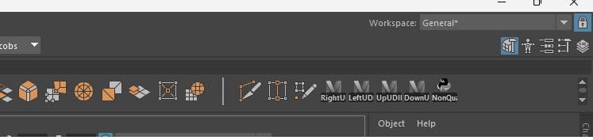

# MayaScripts
Useful scripts for working with Maya

# How to use the scripts

1) Find the script you want to use. Use either the Python or MEL version
2) Open Maya
3) Open the Script Editor (Windows -> General Editors -> Script Editor) OR the button at the bottom right of Maya
4) Click on the small + button
5) Choose Python or MEL, depending on the script you chose (I will either have both or 1 of them available)
6) Copy and Paste the code in the editor
7) Now go (File -> Save script to shelf..) and input a name
8) A new button should now be added to the shelf

9) Enjoy
